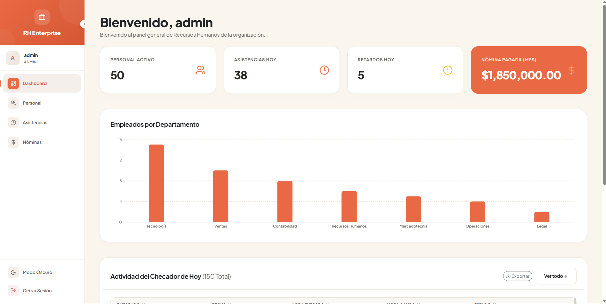
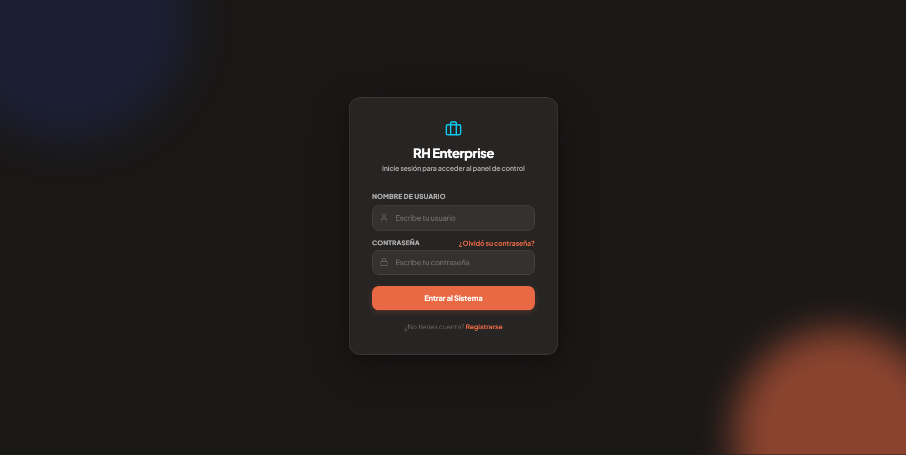
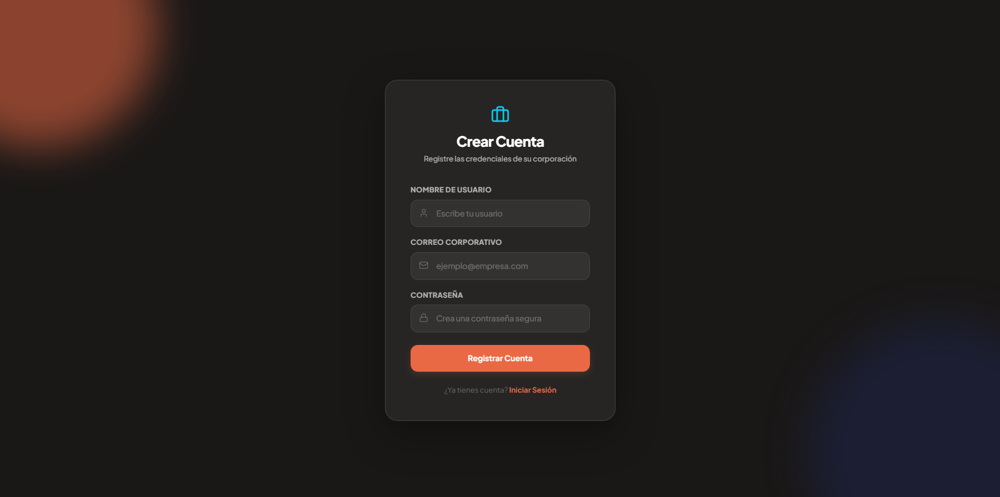
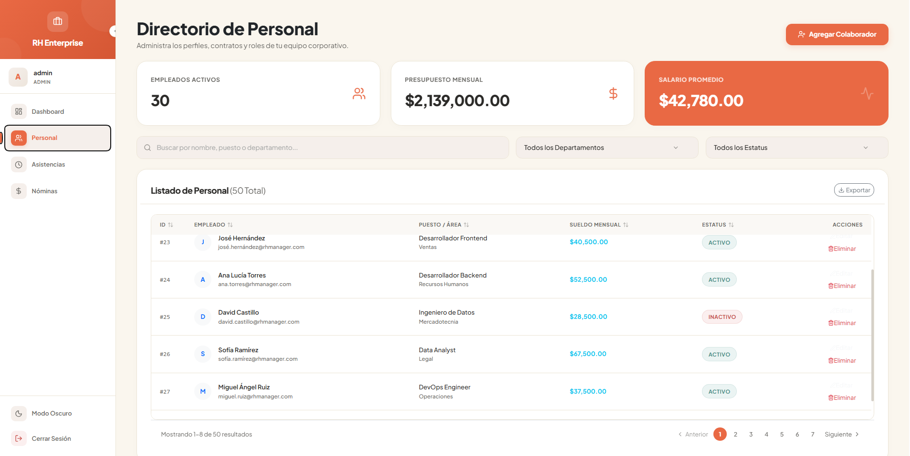
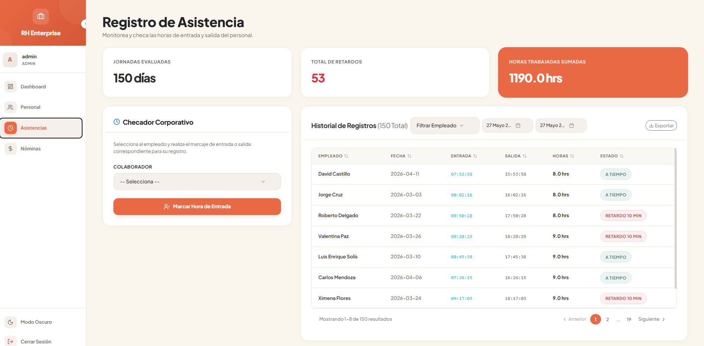
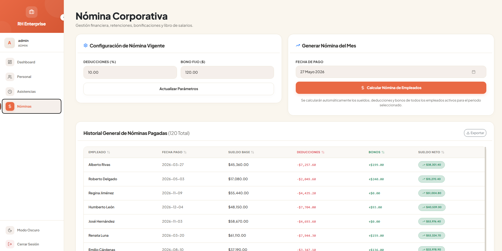
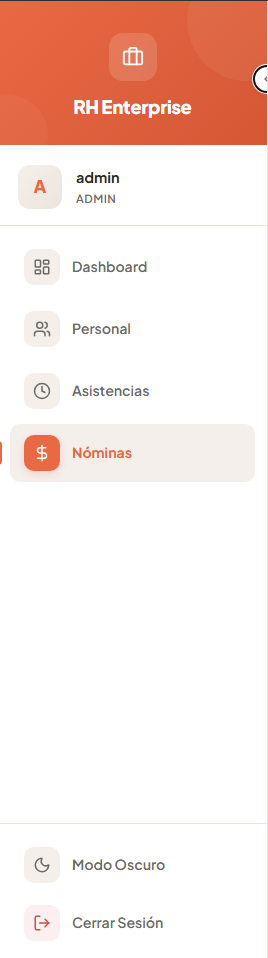
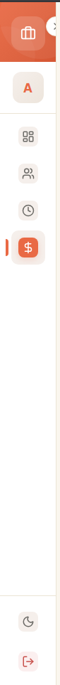
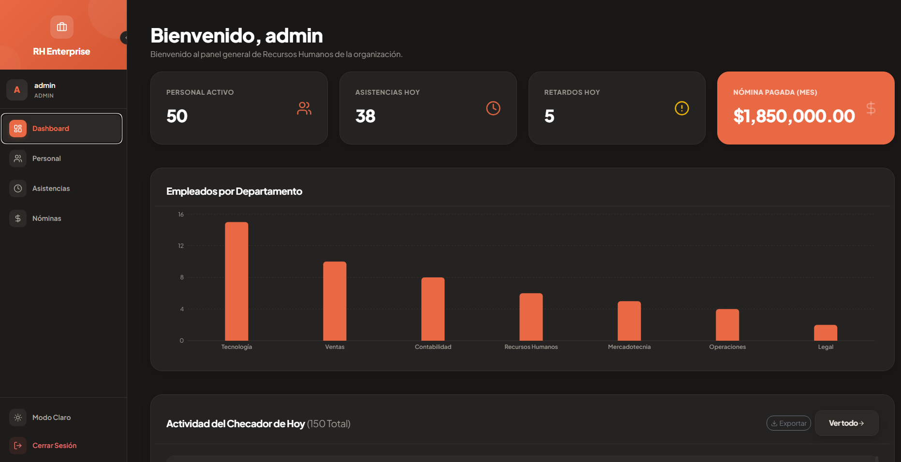

<div align="center">

# RH Manager · Human Resources Management System


Dashboard · Attendance · Payroll · Role-Based Auth · **Sand & Terracotta** Design

</div>



---

## Features

### Frontend (React + Vite)
- **Optimized Pagination** — Truncated page ranges with ellipsis and navigation arrows.
- **Advanced Filters** — Custom-built minimal employee select and animated date picker using Lucide React.
- **Sortable Tables** — Click column headers to sort by any field with direction indicators.
- **Fluid Authentication** — Login, registration, and password recovery with animated background spheres and glassmorphism cards.
- **Responsive Sidebar** — Collapsible with localStorage persistence, role-based menu items, anchored footer.
- **Full Dark Mode** — Consistent dark palette across all components, not a simple color inversion.
- **CSV Export** with UTF-8 BOM for Excel compatibility.

### Backend (Django REST Framework)
- Token-based authentication (DRF TokenAuth).
- Complete employee CRUD with profile photo upload.
- Attendance module with automatic late detection (> 8:05 AM).
- Monthly payroll calculation with deductions, bonuses, and historical storage.
- Role-based dashboard KPIs (admin / employee).
- Demo data seeder (10 employees, 30 days of attendance, 3 months of payroll).

---

## Tech Stack

| Layer | Technology |
|-------|-----------|
| **Frontend** | React 19, Vite 8, React Router 7, Bootstrap 5, Lucide React |
| **Custom Components** | `ThSortable`, `Pagination`, `ScrollableTable`, `MinimalSelect`, `MinimalDatePicker` |
| **Charts** | Recharts |
| **Backend** | Django 5, Django REST Framework, MySQL 8 |
| **Formatting** | `react-number-format` |

---

## Quick Start

### Prerequisites
- Python 3.10+
- Node.js 18+
- MySQL 8+

### 1. Backend

```bash
cd backend
pip install -r requirements.txt
cp ../.env.example .env   # Edit with your MySQL credentials
python manage.py migrate
python manage.py seed_data   # Demo data
python manage.py runserver
```

Demo users:
| Username | Password | Role |
|----------|----------|------|
| `admin` | `admin123` | Administrator |
| `empleado1` | `empleado123` | Employee |

### 2. Frontend

```bash
cd frontend
npm install
npm run dev
```

Open `http://localhost:5173` in your browser.

### Available Scripts

```bash
npm run dev       # Development with HMR
npm run build     # Production build
npm run preview   # Preview production build
```

---

## Project Structure

```
rh-manager/
├── backend/
│   ├── empleados/
│   │   ├── models.py
│   │   ├── views.py
│   │   ├── serializers.py
│   │   └── management/commands/seed_data.py
│   └── rh_django/settings.py
├── frontend/
│   ├── src/
│   │   ├── components/          # ThSortable, Pagination, MinimalSelect, DatePicker, ScrollableTable
│   │   ├── empleados/           # Dashboard, ListadoEmpleados, ControlAsistencias, ControlNominas
│   │   ├── AuthContext.jsx      # Token-based authentication
│   │   ├── Navegacion.jsx       # Responsive sidebar
│   │   └── index.css            # Complete Sand & Terracotta design system
│   └── public/assets/readme/    # README screenshots
└── README.md
```

---

## API Endpoints

| Method | Endpoint | Description | Auth |
|--------|----------|-------------|------|
| POST | `/api/auth/register` | Register | No |
| POST | `/api/auth/login` | Login (Token) | No |
| POST | `/api/auth/recover-password` | Password recovery | No |
| GET | `/api/dashboard` | Role-based KPIs | Yes |
| GET/POST/PATCH/DELETE | `/api/empleados[/id]` | Employee CRUD | Yes |
| GET/POST/PATCH | `/api/asistencias[/id]` | Attendance | Yes |
| GET/POST | `/api/nominas[/id]` | Payroll | Yes |
| GET/POST | `/api/configuracion-nomina` | Settings | Yes |

---

## Gallery

| Screen | Preview |
|--------|---------|
| **Login** |  |
| **Register** |  |
| **Employee List** |  |
| **Attendance Control** |  |
| **Payroll** |  |
| **Sidebar Expanded** |  |
| **Sidebar Collapsed** |  |
| **Dark Mode** |  |

---

## License

Distributed under the MIT License. See [LICENSE](./LICENSE) for more information.
